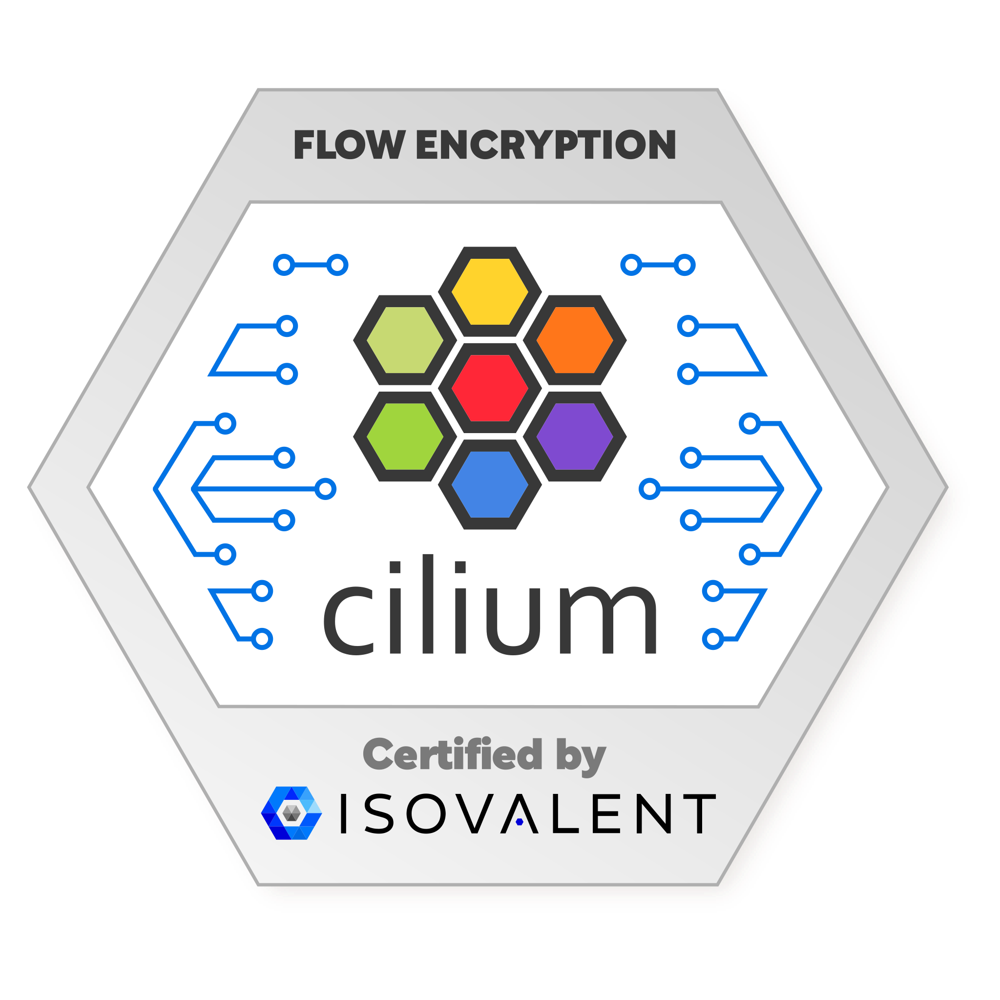

# Testing the configuration of WireGuard

WireGuard was integrated in Linux Kernel 5.6 and greater.

```sh
uname -r
```

example installation with the cilium-cli

```sh
cilium install --version v1.15.9 \
  --set ipam.mode=cluster-pool \
  --set encryption.enabled=true \
  --set encryption.type=wireguard \
  --set encryption.nodeEncryption=true
```

verify the installtion has completed

```sh
cilium status --wait
```

verify the setup

```sh
kubectl get ciliumnode [node-name] \
  -o jsonpath='{.metadata.annotations.network\.cilium\.io/wg-pub-key}'
```

exec into an agent

```sh
kubectl -n kube-system exec -ti $CILIUM_POD -- bash
```

verfiy that wireguard was installed

```sh
cilium status | grep Encryption
```

install tcpdump in the pod

```sh
apt-get update
apt-get -y install tcpdump
```

tcpdump on teh wireguard tunnel

```sh
tcpdump -n -i cilium_wg0 | grep ICMP
```

# Testing the configuration of IPsec

https://docs.cilium.io/en/stable/security/network/encryption/

## Deploy the test app

deploy using the endor.yaml manifest

```sh
k apply -f endor.yaml
```

check that the app has been fully deployed

```sh
k get -f endor.yaml
```

## Capture IPsec traffic with tcpdump

run a shell in one of the cilium agents

```sh
k -n kube-system exec -ti ds/cilium -- bash
```

install the packet-analyzer (probably cant be done in a Prod-Env)

```sh
apt-get update
apt-get -y install tcpdump
```

run tcpdump and filter traffic based on the cilium_vxlan interface (this can be used if cilium is deployed in vxlan tunnel mode)
ciliums IPsec implementation uses ESP (Encapsulating Security Payload)

```sh
tcpdump -n -i cilium_vxlan esp
```